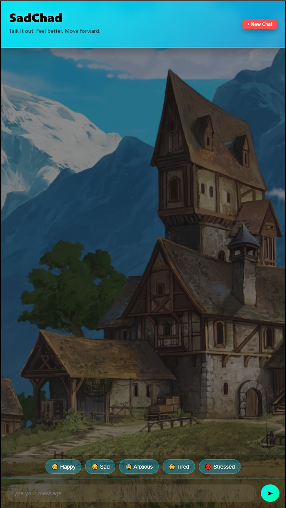
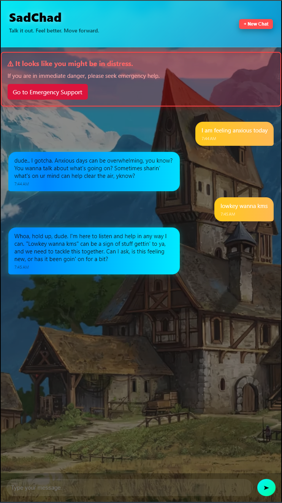
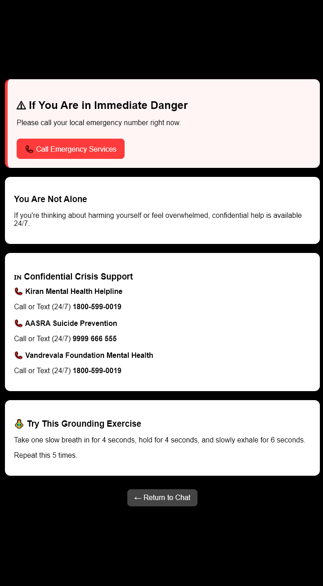

# SadChad – Chat-Based Therapist 💬🧠

SadChad is a **web-based AI mental health support chatbot** designed to provide users with a safe and private environment to express their thoughts and feelings.
The application responds with empathetic, conversational messages and offers simple coping strategies such as breathing exercises, mindfulness tips, and emotional support.

This project was developed as a **BCA Final Year Project** to demonstrate how AI can improve accessibility to mental health guidance.

---

# ✨ Features

* 💬 **AI Chatbot Therapist** – Friendly conversational assistant
* 🧠 **Emotion-based quick prompts** – Start conversations quickly
* ⚠ **Crisis detection system** – Shows emergency resources if self-harm language is detected
* 🎥 **Animated video background UI**
* 🔊 **Chat send / receive sound effects**
* 💾 **Local chat history storage**
* 🌍 **Remote demo support via Cloudflare Tunnel**
* 📱 **Responsive UI for desktop and mobile**

---

# 🛠 Tech Stack

### Frontend

* Angular 17
* HTML / CSS
* TypeScript

### Backend

* Node.js
* Express.js

### AI

* OpenAI API

### Deployment / Demo

* Cloudflare Tunnel

---

# 📂 Project Structure

```
BCA Project
│
├── frontend
│   ├── src
│   ├── dist
│   └── angular.json
│
├── backend
│   ├── server.js
│   └── host.js
│
└── README.md
```

---

# ⚙ Local Development Setup

## 1️⃣ Install dependencies

Frontend

```
cd frontend
npm install
```

Backend

```
cd backend
npm install
```

---

## 2️⃣ Start backend server

```
cd backend
node server.js
```

Backend runs at

```
http://localhost:3000
```

---

## 3️⃣ Start Angular development server

```
cd frontend
ng serve
```

Open in browser:

```
http://localhost:4200
```

---

# 🌍 Remote Demo (Access from Any Device)

The project can be exposed to the internet using **Cloudflare Tunnel**, allowing the chatbot to run on your local machine but be accessed from anywhere.

---

## Step 1 – Build Angular production version

```
cd frontend
ng build --configuration production
```

This generates the production files inside:

```
frontend/dist/frontend/browser
```

---

## Step 2 – Start backend API

```
cd backend
node server.js
```

Runs at:

```
http://localhost:3000
```

---

## Step 3 – Start combined host server

This server serves the Angular UI and proxies API requests.

```
cd backend
node host.js
```

Runs at:

```
http://localhost:8081
```

---

## Step 4 – Start Cloudflare Tunnel

```
cloudflared tunnel --url http://localhost:8081
```

You will receive a public link like:

```
https://something.trycloudflare.com
```

Open this link from **any device on any internet connection** to access the chatbot.

---

# 🏗 System Architecture

```
Internet User
      ↓
Cloudflare Tunnel
      ↓
Node Host Server (8081)
      ↓
Angular Frontend
      ↓
/api/chat
      ↓
Node Backend API (3000)
      ↓
OpenAI API
```

---

# 🧠 How It Works

1. User sends a message through the Angular chat interface.
2. The frontend sends the request to `/api/chat`.
3. The host server forwards the request to the backend API.
4. The backend sends the prompt to the OpenAI API.
5. The response is returned and displayed in the chat UI.

---

# ⚠ Crisis Support

If the chatbot detects keywords related to **self-harm or suicide**, it displays emergency support resources to encourage users to seek professional help.

Example keywords monitored:

* suicide
* kill myself
* end my life
* self harm

---

# 📸 Application Screenshots

## 💬 Chat Interface


The main interface of **SadChad**, where users can talk with the AI chatbot in a conversational format.
Messages appear as chat bubbles with timestamps, creating a familiar messaging experience.

---

## 😊 Emotion Quick Prompts



Users can quickly start conversations by selecting emotions such as **Happy, Sad, Anxious, Tired, or Stressed**.
This helps users express their feelings even if they don't know what to type initially.

---

## ⚠ Crisis Detection System



The chatbot monitors messages for **crisis-related keywords** such as:

* suicide
* self harm
* kill myself
* end my life

If detected, the system immediately shows a warning and suggests accessing emergency support resources.

---

## 🆘 Emergency Support Screen



The emergency support page provides users with **confidential mental health helplines available in India**, including:

* Kiran Mental Health Helpline
* AASRA Suicide Prevention
* Vandrevala Foundation Mental Health Support

The page also includes a **grounding breathing exercise** to help users calm down during distress.

---

⚠ **Disclaimer:**
This chatbot provides supportive conversation and guidance but **is not a replacement for professional mental health care**.


---

# 🚀 Future Improvements

* User authentication
* Therapist directory integration
* Voice input / speech-to-text
* Chat analytics
* Mobile application version

---

# 📜 License

This project is created for **educational purposes (BCA Final Year Project)**.

---

# 👨‍💻 Author

Faiz Freaky

BCA Final Year Project – AI Chat-Based Therapist System
